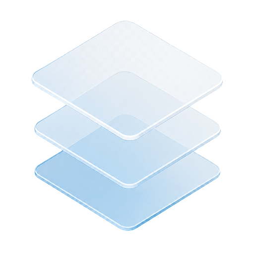

  

<h1 align="center">Glass Stack</h1>

  <em>Server management, made transparent</em>

---

  
  
  
  

---

## About

Glass Stack is an open-source server management platform built for homelabs and self-hosted environments. It provides a clean, transparent interface to manage your servers, install and configure applications via Docker containers, browse and edit files, and interact with your system through a built-in terminal — all from a single dashboard.

The goal is to make server administration accessible and intuitive, without sacrificing power or flexibility. Whether you are running a single Raspberry Pi or a multi-node home cluster, Glass Stack gives you visibility and control over your entire infrastructure.

### Features

- **Dashboard** — Real-time overview of your server status, resources, and running services.
- **Applications Store** — Install, update, and remove Docker-based applications with a few clicks.
- **File Manager** — Browse, upload, edit, and manage files directly from the browser.
- **Terminal** — Full shell access to your server without leaving the interface.
- **Settings** — Customize appearance, themes, wallpapers, and system preferences.

## Stack

### Frontend

- **Framework**
  - [React](https://react.dev/)
- **Language**
  - [TypeScript](https://www.typescriptlang.org/)
- **UI Layer**
  - [Tailwind CSS](https://tailwindcss.com/)
  - [Framer Motion](https://www.framer.com/motion/)
  - [Lucide React](https://lucide.dev/)
  - [D3.js](https://d3js.org/)
- **State + Data**
  - [Zustand](https://zustand-demo.pmnd.rs/)
  - [TanStack Query](https://tanstack.com/query)
  - [Axios](https://axios-http.com/)
- **Routing**
  - [React Router](https://reactrouter.com/)
- **Bundler + Tooling**
  - [Vite](https://vite.dev/)
- **Linter + Code Style**
  - [OxLint](https://oxc.rs/docs/guide/usage/linter)
  - [Prettier](https://prettier.io/)
- **Testing**
  - [Vitest](https://vitest.dev/)
  - [Testing Library](https://testing-library.com/)

### Backend

- **Language**
  - [Go](https://go.dev/)
- **HTTP Server**
  - [net/std](https://pkg.go.dev/net/http)
- **Database**
  - [SQLite](https://www.sqlite.org/)
- **Container Management**
  - [Docker Engine API](https://docs.docker.com/engine/api/)
- **Real-time Events**
  - Server-Sent Events (SSE)
- **System Monitoring**
  - Host metrics via Go syscalls

## Useful Links

- [Figma](https://www.figma.com/design/u7JQalT1bK3498NiMmLLvg/GlassStack)
- [GitHub Issues](https://github.com/ipetinate/glass-stack/issues)

## Project Documentation

The product, architecture, roadmap, and delivery backlog live in the
[GlassStack Obsidian vault](./docs/vault/00-start-here/GlassStack.md).
The vault can also be read as regular Markdown without Obsidian.
